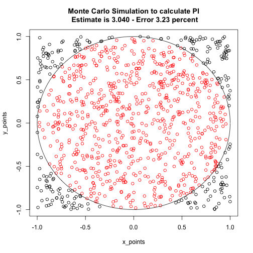
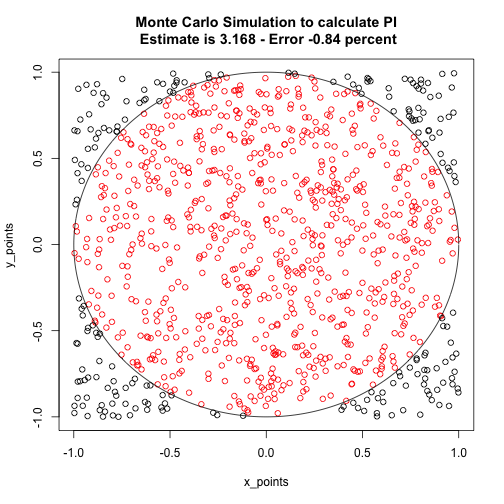

Calculation of Pi Using the Monte Carlo Method
========================================================
author: Michael Riggs
date: 12/19/2014

Overview
========================================================
- "Monte Carlo Method" - method of solving problems with simulation of random events.
- Given an probability "P" of an event, generate random event
- Calculate P as #successful Events/#Events
- To esitmate Pi , generate 2 random numbers in (-1,1) 
- If each are X&Y points inside a square,
  then P(X,Y) inside the circle P(sqrt(x^2 + y^2 ) <1) is Pi/4
- More points in the simulation will generally give better accuracy

- Ref - http://www.eveandersson.com/pi/monte-carlo-circle

How to use the app
========================================================
- Go to https://mriggs78729.shinyapps.io/DataProducts/
- Select the number of points for the application
- Simulation will run
- Pi estimate is in the plot title

- More points will *generally* be more accurate

Example using 1000 points
========================================================

 
Example using 500 points
========================================================

 

